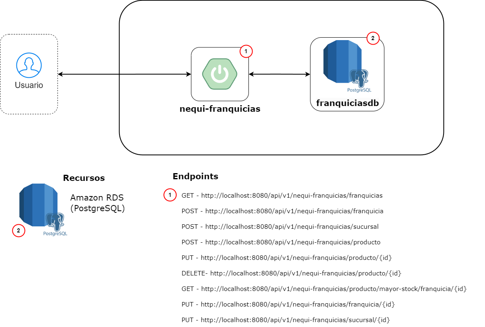

**nequi-franquicias**

-red?logo=java)


#### Tabla de contenido

- [Descripción de la necesidad](#descripción-de-la-necesidad)
- [Diagrama de arquitectura de la solución](#diagrama-de-arquitectura-de-la-solución)
- [Manual de despliegue en ambiente local](#manual-de-despliegue-en-ambiente-local)
- [Ejemplos de JSON para Request y Response](#ejemplos-de-json-para-request-y-response)

#### Descripción de la necesidad

**¿Qué?** Desarrollar una API para manejar una lista de franquicias de la empresa Nequi.</br>

#### *Criterios de aceptación*

- Exponer endpoint para crear una nueva franquicia.
- Exponer endpoint para agregar una nueva sucursal a una franquicia.
- Exponer endpoint para agregar un nuevo producto a una sucursal.
- Exponer endpoint para eliminar un producto a una sucursal.
- Exponer endpoint para modificar el stock de un producto.
- Exponer endpoint para mostrar el producto con mayor stock por las sucursales asociadas a una franquicia determinada.
- Exponer endpoint para actualizar el nombre de una franquicia.
- Exponer endpoint para actualizar el nombre de una sucursal.
- Exponer endpoint para actualizar el nombre de un producto.

#### Diagrama de arquitectura de la solución



#### Manual de despliegue en ambiente local
- [x] Contar con el JDK y JRE debidamente instalados en el sistema y configurados en las variables de entorno correctamente:
    - Ejemplo:
        - **JDK:**
            - **Variable name:** JAVA_HOME
            - **Variable value:** C:\Users\cristhian\.jdks\temurin-17.0.8
        - **JRE:**
            - **Variable name:** JRE_HOME
            - **Variable value:** C:\Program Files\Java\jre1.8.0_341\bin

- [x] Contar con un Entorno de Desarrollo Integrado (IDE), por ejemplo, IntelliJ IDEA.
- [x] Tener instalada la aplicación Postman.

### Ejecución del servicio:
- [x] Clonar o descargar el proyecto desde el repositorio.
- [x] Ejecutar el servicio con las configuraciones correspondientes al JDK de Java 17, por ejemplo, temurin-17.0.8.
- [x] Importar la colección de Postman existente en los recursos de la aplicación (applications/app-service/src/main/resources/nequi-franquicias.postman_collection.json).
- [x] La documentación del servicio generada por Swagger puede ser visualizada en la ruta <http://localhost:8080/doc/swagger-ui/index.html>.
- [x] El seguimiento a los cambios en la base de datos pueden ser visualizados realizando la conexión con pgAdmin <https://www.pgadmin.org/download/>.
    - Datos de conexión:
        - **Host name/address:** jdbc:postgresql://franquiciasdb.clmou0w42wur.us-east-1.rds.amazonaws.com
        - **Port:** 5432
        - **Database:** franquiciasdb
        - **Username:** postgres
        - **Password:** postgres

#### *Prerrequisitos*

- [x] Verificar el repositorio y políticas de acceso

| Nombre            | Ruta                                            | Rama   |
|-------------------|-------------------------------------------------|--------|
| nequi-franquicias | <https://github.com/cy-perez/nequi-franquicias> | Master |

#### Ejemplos de JSON para request y response

- Ejemplo de JSON enviado para la creación de una franquicia
``` json
{
    "nombreFranquicia": "Titiribí"
}
```

- Ejemplo de response para la creación de una franquicia
``` json
{
    "transactionId": "b75d42b9-6ebf-40f1-91b1-2da114d912f4",
    "code": 201,
    "message": "Creacion exitosa",
    "data": {
        "id": 11,
        "nombre": "Titiribí"
    }
}
```

- Ejemplo de JSON enviado para la creación de una sucursal
``` json
{
    "nombreSucursal": "El Centenario",
    "idFranquicia": 10
}
```

- Ejemplo de response para la creación de una sucursal
``` json
{
    "transactionId": "ce6def3f-0a5a-4a7f-a501-3ff85fea2eaf",
    "code": 201,
    "message": "Creacion exitosa",
    "data": {
        "id": 31,
        "nombre": "El Centenario",
        "franquicia": {
            "id": 10,
            "nombre": "Titiribí"
        }
    }
}
```

- Ejemplo  de JSON enviado para la creación de un producto
``` json
{
    "nombreProducto": "Posh Micro X S240",
    "cantidad": 10,
    "idSucursal": 30
}
```

- Ejemplo de response para la creación de un producto
``` json
{
    "transactionId": "416156d9-e23f-4841-bf1a-4a2fefec9b94",
    "code": 201,
    "message": "Creacion exitosa",
    "data": {
        "id": 25,
        "nombre": "Posh Micro X S240",
        "cantidad": 10,
        "sucursal": {
            "id": 30,
            "nombre": "La Violeta",
            "franquicia": {
                "id": 5,
                "nombre": "Sabaneta"
            }
        }
    }
}
```

- Ejemplo de response para la consulta de franquicias
``` json
{
    "transactionId": "89d00ba3-8720-4add-a163-120f1837f3d8",
    "code": 200,
    "message": "Exitoso",
    "data": [
        {
            "id": 1,
            "nombre": "Bello"
        },
        {
            "id": 2,
            "nombre": "Itagüí"
        },
        {
            "id": 3,
            "nombre": "Medellín"
        },
        {
            "id": 4,
            "nombre": "Caldas"
        }
    ]
}
```

- Ejemplo de response para la consulta de producto con mayor stock por las sucursales asociadas a una franquicia determinada
``` json
{
    "transactionId": "45042f4b-7956-46c6-847e-4c2e6a577f0a",
    "code": 200,
    "message": "Exitoso",
    "data": [
        {
            "id": 24,
            "nombre": "Posh Micro X S240",
            "cantidad": 15,
            "sucursal": {
                "id": 8,
                "nombre": "Fátima",
                "franquicia": {
                    "id": 3,
                    "nombre": "Medellín"
                }
            }
        },
        {
            "id": 14,
            "nombre": "LG Optimus Z",
            "cantidad": 20,
            "sucursal": {
                "id": 9,
                "nombre": "Altavista",
                "franquicia": {
                    "id": 3,
                    "nombre": "Medellín"
                }
            }
        }
    ]
}
```